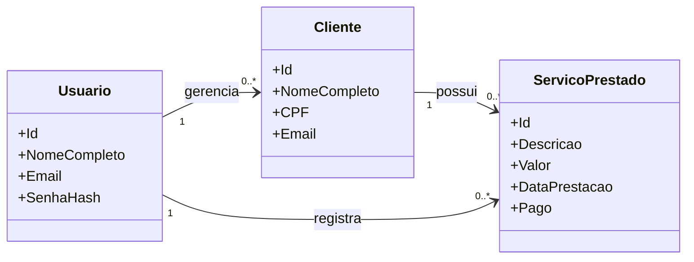
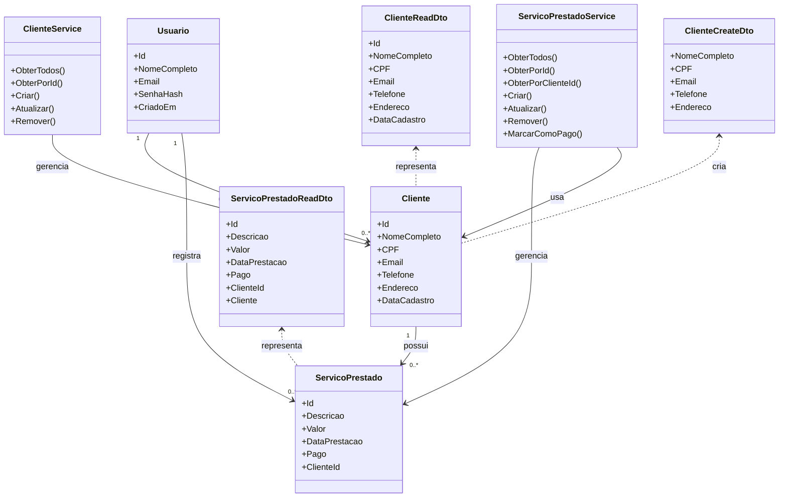
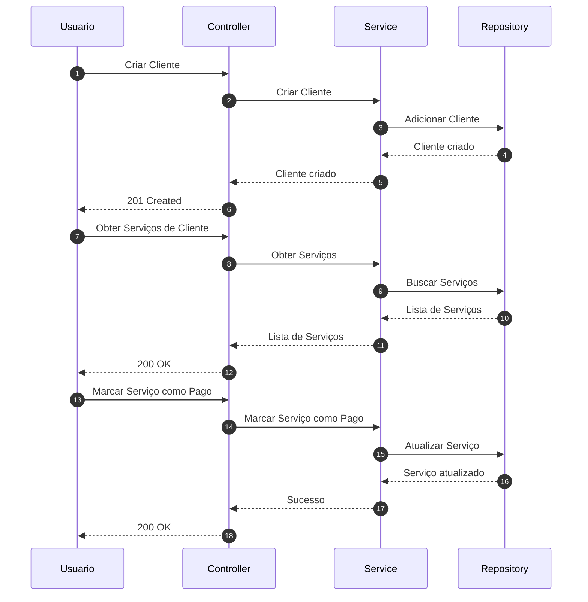

# ContabiliHub


Sistema de apoio à gestão contábil para contadores autônomos, permitindo cadastro de clientes, registro de serviços (como IR), emissão de recibos e controle de honorários.

---

## > Visão Geral

O **ContabiliHub** é uma API para gestão de clientes e serviços contábeis, focada na produtividade do contador autônomo. Proporciona controle centralizado de clientes, serviços prestados, autenticação segura, emissão de recibos e histórico de operações.

Tudo em um ambiente seguro, moderno e 100% baseado em APIs RESTful.

---

## > Tecnologias Utilizadas

- **.NET 8** (C#)
- **Entity Framework Core** (ORM)
- **SQL Server** (Banco de Dados)
- **JWT** (Autenticação)
- **Swagger / OpenAPI** (Documentação)
- **Clean Architecture** (Separação de responsabilidades)

---

## > Padrões Arquiteturais

```
src/
├── ContabiliHub.Domain/         # Entidades de domínio, interfaces de repositório
├── ContabiliHub.Application/    # DTOs, serviços de aplicação, validadores
├── ContabiliHub.Infrastructure/ # Persistência, repositórios EF Core
├── ContabiliHub.API/            # Controllers, configuração API
```

- **Domain:** Entidades puras e contratos (sem dependência de infraestrutura)
- **Application:** DTOs, regras de negócio, interfaces de serviços
- **Infrastructure:** Implementação de acesso a dados, EF Core, repositórios
- **API:** Controllers, autenticação, injeção de dependências, documentação

**Diagrama de classes e sequência:**

> Modelo somente com entidades de domínio



> Modelo conceitual amplo



> Diagrama de sequência com fluxo essencial da API



---

## > Casos de Uso

1. Contador registra-se → obtém token JWT
2. Cadastra clientes → valida CPF único
3. Registra serviços prestados → vincula ao cliente
4. Emite recibos digitais → para envio/impressão
5. Controla status de pagamento → gestão financeira

---

## > Funcionalidades

- 🔐 **Autenticação JWT** (registro, login, proteção de rotas)
- 👥 **Gestão de Clientes** (CRUD completo)
- 🧾 **Serviços Prestados** (CRUD, vínculo com cliente)
- 📄 **Recibos Digitais** (emissão automática para serviços)
- 🛡️ **Validação de dados nativa** (.NET 8, sem dependências externas)
- 📚 **Swagger UI** para explorar e testar endpoints

---

## > Pré-requisitos

- .NET 8 SDK
- SQL Server LocalDB ou Express
- Docker _(para futuro uso)_
- Visual Studio, VS Code ou IDE de sua preferência

---

## > Como Executar o Projeto

```bash
# Clone o repositório
git clone https://github.com/zosein/ContabiliHub-API.git
cd ContabiliHub

# Restaure as dependências
dotnet restore

# Compile e gere o banco (necessário para primeira execução)
dotnet ef database update --project src/ContabiliHub.Infrastructure --startup-project src/ContabiliHub.API

# Execute a aplicação
dotnet run --project src/ContabiliHub.API
```

- Acesse o **Swagger**: [https://localhost:{SUA_PORT}/swagger](https://localhost:{SUA_PORT}/swagger)
- Por padrão, o banco será criado como `ContabiliHubDb` na instância SQL definida em `appsettings.json`.

---

## > Exemplos de Uso

### 1. Registro de Usuário

```http
POST /api/auth/register
Content-Type: application/json

{
  "nomeCompleto": "João Contador",
  "email": "joao@email.com",
  "senha": "senha123"
}
```

### 2. Login (obtenção de token JWT)

```http
POST /api/auth/login
Content-Type: application/json

{
  "email": "joao@email.com",
  "senha": "senha123"
}
```

**Resposta:**

```json
{
  "token": "<jwt_token>"
}
```

### 3. Cadastro de Cliente (requer Bearer Token)

```http
POST /api/clientes
Authorization: Bearer <jwt_token>
Content-Type: application/json

{
  "nomeCompleto": "Maria Cliente",
  "cpf": "12345678901",
  "email": "maria@email.com",
  "telefone": "11999999999",
  "endereco": "Rua das Flores, 123"
}
```

### 4. Registro de Serviço Prestado

```http
POST /api/servicosprestados
Authorization: Bearer <jwt_token>
Content-Type: application/json

{
  "clienteId": "<id_cliente>",
  "descricao": "Declaração de IR 2025",
  "valor": 250,
  "dataPrestacao": "2025-07-07T00:00:00",
  "pago": true
}
```

### 5. Emissão de Recibo

```http
GET /api/servicosprestados/{id}/recibo
Authorization: Bearer <jwt_token>
```

---

## > Documentação Interativa

Acesse o **Swagger UI** para explorar e testar todos os endpoints:

- [https://localhost:{SUA_PORT}/swagger](https://localhost:{SUA_PORT}/swagger)

---


---

## > Roadmap / TODO

- ✅ API funcionalmente completa
- ✅ Testes unitários automatizados
- 🔄 Containerização Docker
- 🔄 Integração com e-mail para recibos
- 🔄 Sistema de agendamento
- 🔄 Frontend web

---

## > Contribuindo

- Siga o padrão de arquitetura do projeto
- Sempre crie uma interface antes da implementação de serviço/repositório
- Commits semânticos (`feat:`, `fix:`, `refactor:`, etc)
- Utilize DTOs nos controllers
- Teste localmente antes de enviar PRs

---

## > Licença

Este projeto está licenciado sob os termos da [MIT License](LICENSE).

---

<p align="center">
  <br>
  <b>ContabiliHub</b>: Simplificando a vida do contador!
</p>
